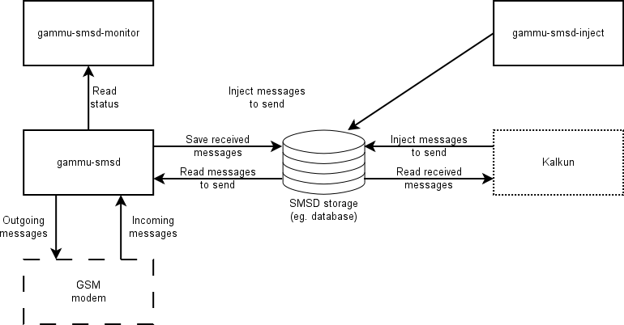

SMS Daemon
==========

Gammu SMS Daemon is a program that periodically scans GSM modem for received
messages, stores them in defined storage and also sends messages enqueued in
this storage.

   Interaction of SMSD programs

Backend services
----------------

The backend service is used to store messages (both incoming and queue of
outgoing ones).

Files service
+++++++++++++

Files service stores all messages as files in folders defined by configuration.

Database based services
+++++++++++++++++++++++

All database based services share same (or similar) database schema. Currently
following databases are supported:

* MySQL
* PostgreSQL
* libDBI driver, which can connect to various other databases

Null service
++++++++++++

This service is there primarily for testing purposes, as it does not store
messages at all.
