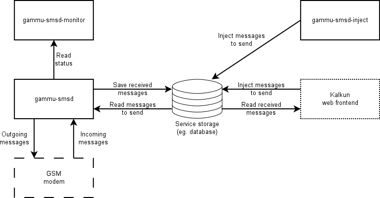

Overview
========

Overall schema
--------------

   Interaction of SMSD programs

SMSD operation
--------------

The SMSD operation consist of several steps.

1. Process command line options.
2. Configure backend service.
3. Main loop is executed until it is signalled to be terminated.
    1. Try to connect to phone if not connected.
    2. Check for security code if configured (configured by ``CheckSecurity``).
    3. Check for received messages (frequency configured by ``ReceiveFrequency``).
    4. Check for reset of the phone if configured (frequency configured by ``ResetFrequency``).
    5. Check for messages to send (frequency configured by ``CommTimeout``).
    6. Check phone status (frequency configured by ``StatusFrequency``).
    7. Sleep for defined time (``LoopSleep``).
4. Backend service is freed.
